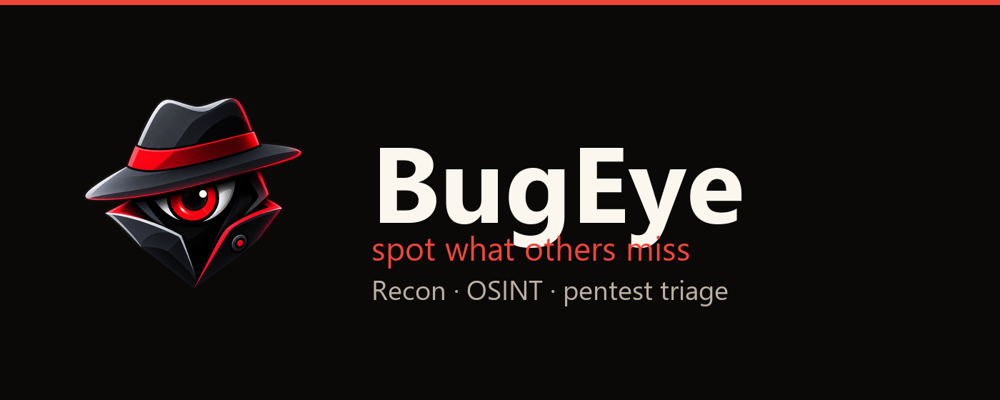
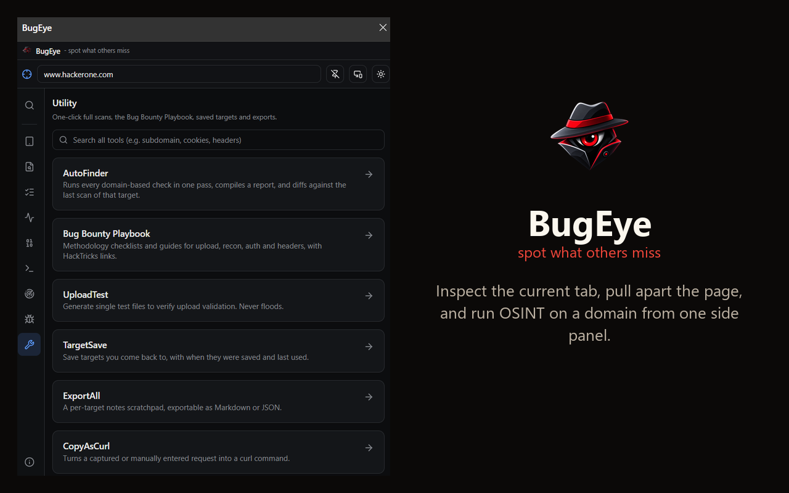
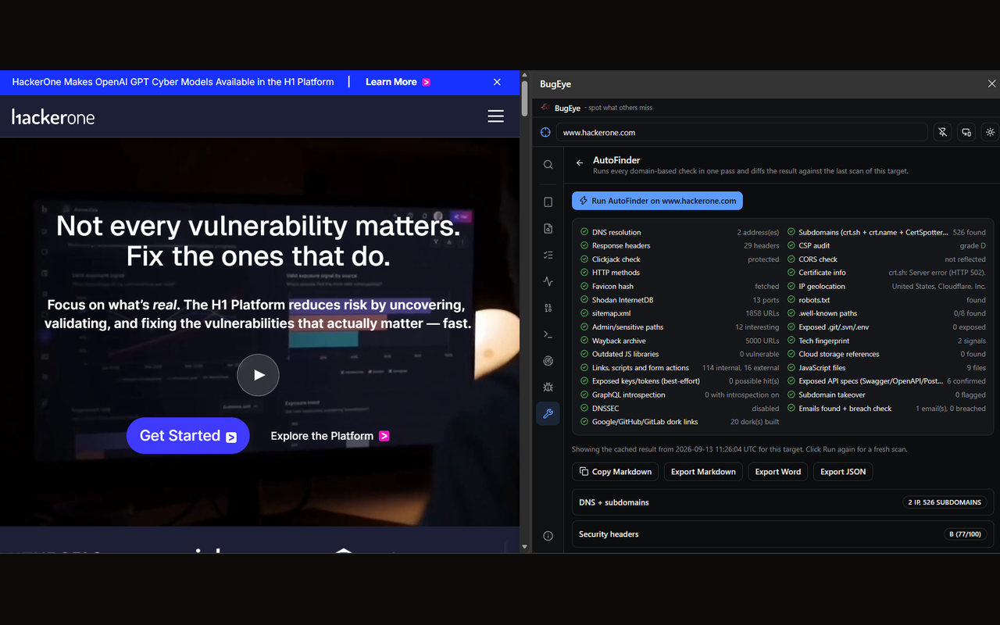

# BugEye

<div align="center">
  
</div>

#### <div align="center">BugEye - spot what others miss</div>

A minimal-permission MV3 browser extension for passive recon, OSINT and web-app
pentest triage. Built with [WXT](https://wxt.dev), React, TypeScript, Tailwind
CSS and shadcn-style components. Original codebase - no code reused from any
other extension.

> For contracted VAPT, bug bounty, and assets you own or are explicitly
> authorized to test. BugEye is recon and OSINT triage: public records,
> fingerprints, and copy-paste CLI. It does not auto-send exploit payloads,
> run DoS, or brute-force logins.

Works on **Chrome, Edge, Brave, Opera** and other Chromium browsers, and
**Firefox** (MV3). Safari is not supported.

<p align="center">
  
</p>

---

## Features

BugEye puts **80+ focused tools** in a browser side panel, grouped into nine
"pillars":

| Pillar | What it's for | Example tools |
| --- | --- | --- |
| **Tab Inspector** | Inspect the page you're on | HeaderGrade, CookieJar, CSPAudit, WAFDetect, JwtAudit |
| **Page Recon** | Pull apart the current page | LinkGrab, JSList, SecretScan, SourceMapFind, FormAudit |
| **List Triage** | Handle many URLs at once | BulkOpen |
| **Traffic** | Change the requests you send | HeaderInject, UASwitch, RefControl, ReqLogger |
| **Encode / Payload** | Encode/decode & inspect | EncoderKit, JwtAudit, ShellGen |
| **CLI Bridge** | Copy-paste CLI recipes | ReconBuild, FuzzBuild, LinuxCmds, PEASGet |
| **OSINT** | Domain intel from public sources | SubFinder, DNSRecords, WhoisLookup, SearchEngines, UrlScanPeek |
| **Vuln Hunting** | Manual checks & payloads | PayloadLib, AuthDiff, RetireJS, WPCheck, GraphQLCheck |
| **Utility** | One-click scans & workflow | AutoFinder, Bug Bounty Playbook, ExportAll |

Privacy-first: **no analytics, no telemetry, no BugEye servers.** Every request
goes straight from your browser to the public service you asked it to query.

> Full tool list with a one-line description of each tool:
> **[bugeye.vercel.app/features.html](https://bugeye.vercel.app/features.html)**

<details>
<summary><strong>See all 82 tools</strong></summary>

- **Tab Inspector**: HeaderGrade, TechStack, CookieJar, ClickjackCheck, CSPAudit, CORSCheck, CachePoison, HstsPreload, RedirectTrace, CVELookup, HTTPMethods, StorageDump, WAFDetect
- **Page Recon**: LinkGrab, JSList, SriCheck, SecretScan, SourceMapFind, FormAudit, HiddenFind, LinkedContent, TrackerScan
- **List Triage**: BulkOpen
- **Traffic**: HeaderInject, UASwitch, RefControl, ReqLogger
- **Encode/Payload**: EncoderKit (Base64/URL/HTML/Hex/JWT/Hash/Chain), JwtAudit, ShellGen
- **CLI Bridge**: ReconBuild, NetCmds, LinuxCmds, PEASGet, FuzzBuild, WordlistPick, StegGen
- **OSINT**: SubFinder, ParamMiner, SearchEngines, UrlScanPeek, BucketSpot, ExifPeek, SSLInspect, FaviconHash, IPGeo, ShodanPeek, RobotsPeek, SitemapFind, WellKnownScan, ApiSpec, PanelHunt, GitFinder, Wayback, ContactGrab, EmailHunter, EmailAnalyze, MailHunt, UserHunt, BreachCheck, GoogleDork, GitDork, TakeoverCheck, DNSRecords, WhoisLookup, DNSSECCheck, HostCluster
- **Vuln Hunting**: PayloadLib, AuthDiff, RetireJS, WPCheck, GraphQLCheck, BlindXSS, BlindSQLi, PHPFilterChain
- **Utility**: AutoFinder, Bug Bounty Playbook, UploadTest, TargetSave, ExportAll, CopyAsCurl, JSONView

</details>

<p align="center">
  
</p>

---

## Install it (manual, until the store versions are approved)

**This is for everyone - no coding needed.** You just download a file, unzip
it, flip one switch in your browser, and point the browser at the folder. It
takes about two minutes.

BugEye's Chrome Web Store / Edge / Firefox listings are in review. Until they go
live, use the steps below.

### Step 1 - Download the build for your browser

Go to the **[Releases page](https://github.com/Esther7171/bugeye/releases/latest)**
and open the **Assets** list:

<p align="center">
  
</p>

Download the file that matches your browser:

| Your browser | Download the file ending in |
| --- | --- |
| **Chrome, Edge, Brave, Opera, Vivaldi** and any other Chromium browser | `-chrome.zip` |
| **Firefox** | `-firefox.zip` |

> All Chromium-based browsers use the **`-chrome.zip`** build. Only Firefox uses
> the `-firefox.zip` one. (`-sources.zip` is only for store reviewers - you
> don't need it.)

### Step 2 - Unzip it

A `.zip` is a compressed folder; your computer has to unpack it first.

- **Windows:** right-click the downloaded file → **Extract All...** → a new
  folder appears next to it.
- **Mac:** double-click it in Finder → a new folder appears next to it.

Remember where that unzipped folder is - you'll pick it in Step 4.

> Don't run `npm install` or any command. The unzipped folder is already a
> finished, ready-to-use extension.

### Step 3 - Turn on Developer mode

This is a normal, built-in browser setting for loading extensions that aren't
from the store yet. Copy the address for your browser into the address bar and
press Enter, then flip the switch:

| Browser | Open this address | Turn on |
| --- | --- | --- |
| **Chrome** | `chrome://extensions` | **Developer mode** toggle, top-right |
| **Edge** | `edge://extensions` | **Developer mode** toggle, left sidebar |
| **Brave** | `brave://extensions` | **Developer mode** toggle, top-right |
| **Opera** | `opera://extensions` | **Developer mode** toggle, top-right |
| **Firefox** | `about:debugging#/runtime/this-firefox` | *(nothing to toggle - go to Step 4)* |

### Step 4 - Load the extension

**Chrome / Edge / Brave / Opera / Chromium:**
1. Click **Load unpacked** (it appears after Developer mode is on).
2. Select the **folder** you unzipped in Step 2 (the folder itself, not a file
   inside it).
3. BugEye now shows up in your extensions list.

**Firefox:**
1. Click **Load Temporary Add-on...**
2. Open the unzipped folder and select the **`manifest.json`** file inside it.
3. BugEye now shows up in your add-ons list.

### Step 5 - Open it

- Click the puzzle-piece icon in the toolbar, find **BugEye**, and pin it.
- Click the BugEye icon (or press **Ctrl+Shift+K**) to open its side panel.

> **Updating / keeping it:** on Chromium browsers the install stays after a
> restart - to update, download the newer zip, unzip over the same folder, and
> click the refresh icon on BugEye's card. On **Firefox**, temporary add-ons are
> removed on restart (a Firefox rule for unsigned extensions), so repeat
> Steps 3-4 - this goes away once the signed AMO version is live.

---

## How to use it

1. Open the side panel (toolbar icon or **Ctrl+Shift+K**).
2. Type a **target domain** (e.g. `example.com`) in the target bar, or just use
   the tab you're on.
3. Pick a tool from a pillar, or type in the **search-all-tools** box.
4. The first time a tool needs to read a site, grant access once - after that
   every tool works with no repeated prompts.

**AutoFinder** is the fastest start: it runs every domain-based check in one
pass and compiles a report you can export as Markdown, JSON or Word.

<p align="center">
  
</p>

---

## Permissions

Declared upfront: `storage`, `cookies`, `tabs`, `activeTab`, `scripting`,
`webRequest`, `declarativeNetRequest`. Chromium also uses `sidePanel`; Firefox
uses `sidebar_action` instead. No `host_permissions` are declared statically -
each tool requests access to a specific site only when you actually use it
against that target (see the "why these permissions?" info button at the bottom
of the sidebar).

## Privacy

BugEye collects no personal data, has no analytics or telemetry, and runs no
server of its own - every request goes straight from your browser to the public
service you asked it to query. Anything you save (targets, notes, optional API
keys) stays in your own browser storage.

Full policy: **[esther7171.github.io/bugeye/privacy](https://esther7171.github.io/bugeye/privacy)**
(source in [docs/privacy.md](docs/privacy.md); also mirrored in
[PRIVACY.md](PRIVACY.md)).

---

## Develop

```powershell
npm install
npm run dev          # Chromium WXT dev server
npm run dev:firefox  # Firefox
npm run build        # -> .output/chrome-mv3
npm run build:firefox
npm run compile      # type-check only
```

**Chrome / Edge / Brave:** `npm run build`, then `chrome://extensions` →
Developer mode → Load unpacked → `.output/chrome-mv3`.

**Firefox:** `npm run build:firefox`, then
`about:debugging#/runtime/this-firefox` → Load Temporary Add-on →
`.output/firefox-mv3/manifest.json`.

### Building store packages

`npm run package` builds and zips both browsers, writing to `.output/`:
`bugeye-<version>-chrome.zip` (Chrome/Edge), `bugeye-<version>-firefox.zip`
(AMO), and `bugeye-<version>-sources.zip` (reviewable source for AMO). All three
are attached to each GitHub release.

### For AMO reviewers

The uploaded add-on is bundled/minified, so AMO requires source. Attach
`bugeye-<version>-sources.zip` and give these build steps (Node 20+):

```bash
npm ci
npm run zip:firefox
```

This reproduces the reviewed add-on at `.output/bugeye-<version>-firefox.zip`.
No API keys or network services are needed to build. The extension collects no
data (`data_collection_permissions` is declared as `none`).

### Layout

- `entrypoints/background.ts` - service worker: message router, fetch proxy, DoH resolver, webRequest capture, tab opener, permissions.
- `entrypoints/sidepanel/` - the side panel app shell (`App.tsx`).
- `components/shell/` - sidebar, target bar, command palette, theme, banners.
- `components/modules/<name>/` - one self-contained folder per tool.
- `components/modules/registry.ts` - maps module id → component.
- `lib/` - messaging types, storage helpers, encoding/hashing, grading logic.
- `landing-site/` - the marketing site (bugeye.vercel.app), deployed separately.

---

## Thanks

> **A note of thanks** - BugEye is built for the security community: bug-bounty
> hunters, CTF players, students, and VAPT teams. If it helped you spot
> something, a ⭐ on the repo, a bug report, or a feature idea means a lot.
> Use it responsibly, stay in scope, and happy hunting.

Maintained by [Esther7171](https://github.com/Esther7171) · Licensed under
[AGPL-3.0](LICENSE).
